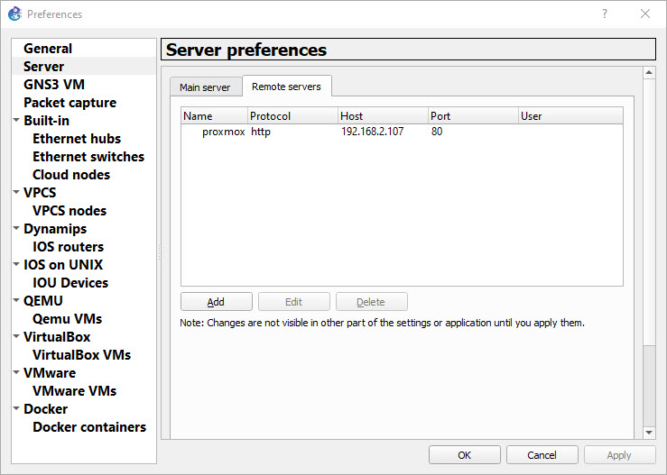
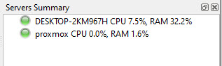
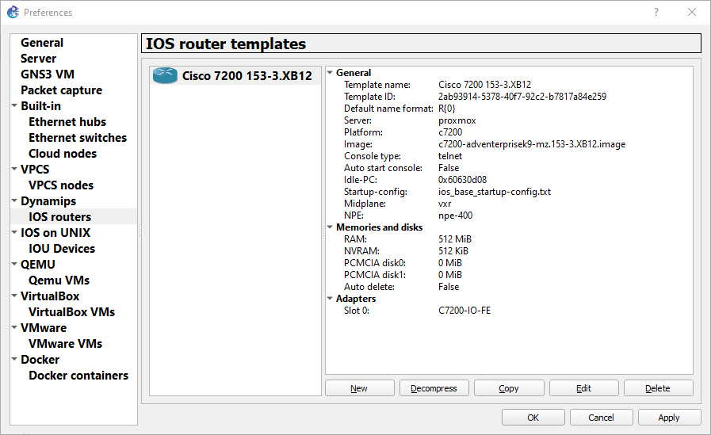
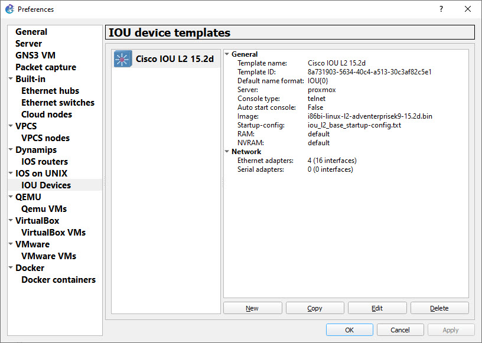
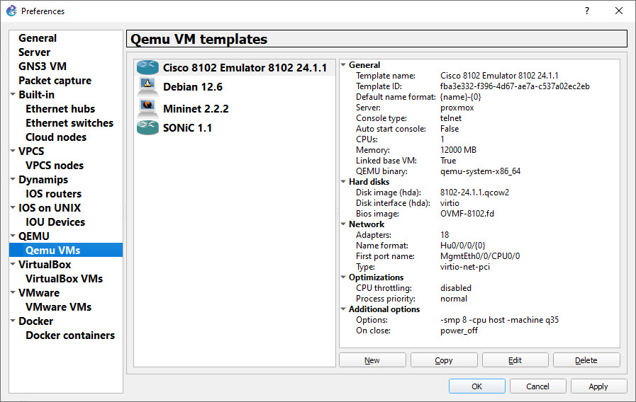
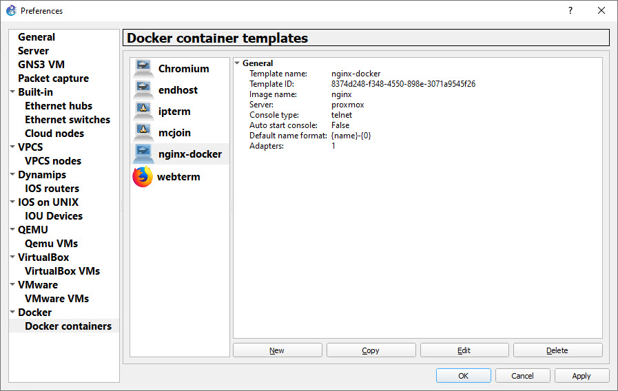
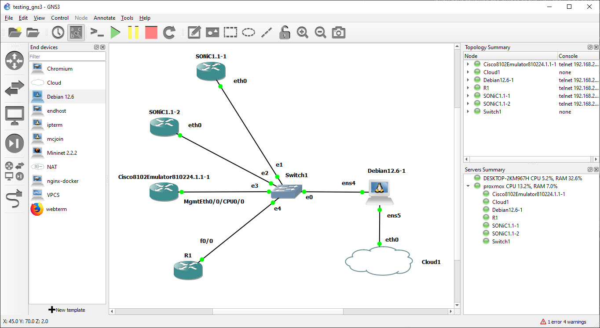

# GNS-Bench

GNS-Bench is a structured setup guide designed to help users build and simulate complex network topologies using GNS3. It focuses on integrating a variety of network operating systems, including Cisco IOS, SONiC NOS, and other virtual appliances, within a unified virtual lab environment. The primary goal is to assist users in preparing GNS3 to run diverse network devices by walking through image setup, appliance configuration, and topology creation. This project is ideal for engineers, researchers, and home lab enthusiasts interested in learning and testing real-world NOS behavior in a virtualized, non-production setting.

The following documentation provides a step-by-step introduction to setting up and using GNS3:

- [Overview of GNS3 and its capabilities](docs/01_GNS3_Intro.md)
- [Installation instructions for GNS3 and GNS3 VM](docs/02_GNS3_Install.md)
- [How to import and configure appliances](docs/03_GNS3_Appliance.md)
- [Setup and usage of SONiC virtual switches](docs/04_GNS3_Sonic_VS.md)
- [Configuration for Cisco 8102 devices in GNS3](docs/05_GNS3_Cisco_8102.md)

## Getting Started

Once you've completed the setup guides, you should have GNS3 running on your system, with the GUI connected to either a local or remote GNS3 VM. In this project, GNS3 was installed on a Windows machine and connected to a GNS3 VM hosted on a Proxmox server. To verify server connections, Go to "Edit → Preferences → Server". You should see your main server (local) and any configured remote servers, such as the GNS3 VM.

You can also view active servers in the "Servers Summary" panel within the GNS3 main window:

GNS3 supports multiple emulator backends. To view available templates navigate to "Edit → Preferences". Under each emulator type (Dynamips, IOU, QEMU, Docker), review the registered templates.

Dynamips

IOU

QEMU

Docker

Some appliances (such as QEMU-based images) may already be bound to a specific server. Others, like "Ethernet Switch" or "Cloud", will prompt you to select which server to use when dragged into a topology.

Below is a sample topology built with:

- Two SONiC routers
- One Cisco 8102 router
- One Cisco 7200 router
- One Debian VM (QEMU-based) acting as a management host
- An Ethernet switch connecting all devices
- A Cloud node providing external internet access

This setup enables testing of both data and control plane behavior, along with external connectivity for software updates or telemetry. This project serves as a foundation for future work, where we will build more advanced network scenarios and automation workflows on top of this GNS3 setup.

