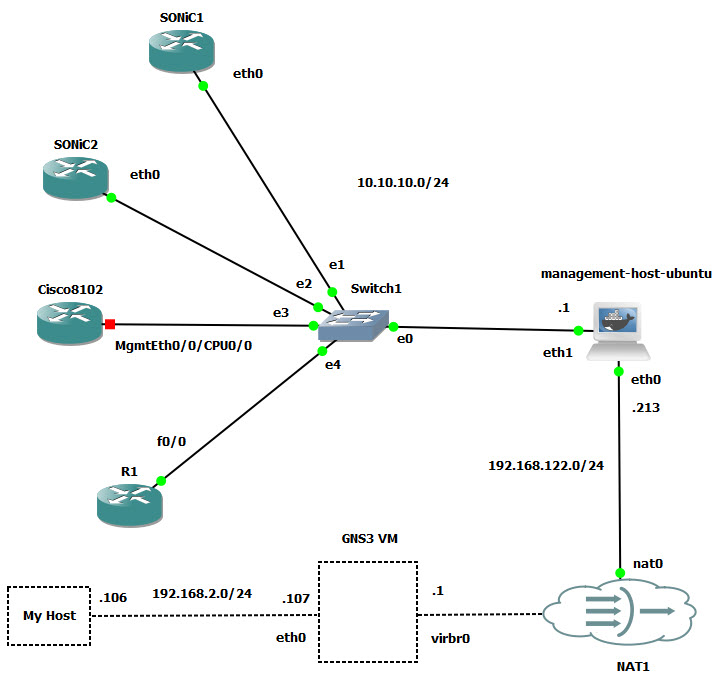

# GNS-Bench

GNS-Bench is a structured setup guide designed to help users build and simulate complex network topologies using GNS3. It focuses on integrating a variety of network operating systems, including Cisco IOS, Sonic NOS, and other virtual appliances, within a unified virtual lab environment. The primary goal is to assist users in preparing GNS3 to run diverse network devices by walking through image setup, appliance configuration, and topology creation. This project is ideal for engineers, researchers, and home lab enthusiasts interested in learning and testing real-world NOS behavior in a virtualized, non-production setting.

The following documentation provides a step-by-step introduction to setting up and using GNS3:

- [Overview of GNS3 and its capabilities](docs/01_GNS3_Intro.md)
- [Installation instructions for GNS3 and GNS3 VM](docs/02_GNS3_Install.md)
- [How to import and configure appliances](docs/03_GNS3_Appliance.md)
- [Setup and usage of Sonic virtual switches](docs/04_GNS3_Sonic_VS.md)
- [Configuration for Cisco 8102 devices in GNS3](docs/05_GNS3_Cisco_8102.md)

## Getting Started

Once you've completed the setup guides, you should have GNS3 running on your system, with the GUI connected to either a local or remote GNS3 VM. In this project, GNS3 was installed on a Windows machine and connected to a GNS3 VM hosted on a Proxmox server. To verify server connections, Go to "Edit → Preferences → Server". You should see your main server (local) and any configured remote servers, such as the GNS3 VM.

You can also view active servers in the "Servers Summary" panel within the GNS3 main window:

GNS3 supports multiple emulator backends. To view available templates navigate to "Edit → Preferences". Under each emulator type (Dynamips, IOU, QEMU, Docker), review the registered templates.

**Dynamips**

**IOU**

**QEMU**

**Docker**

Some appliances (such as QEMU-based images) may already be bound to a specific server. Others, like "Ethernet Switch" or "Cloud", will prompt you to select which server to use when dragged into a topology.

Below is a sample topology built with:

- Two Sonic routers
- One Cisco 8102 router
- One Cisco 7200 router
- One Ubuntu Docker acting as a management host
- An Ethernet switch connecting all devices
- A NAT node providing external internet access

This setup enables testing of both data and control plane behavior, along with external connectivity for software updates or telemetry. This project serves as a foundation for future work, where we will build more advanced network scenarios and automation workflows on top of this GNS3 setup.

## Management Host

The management-host is a Docker container that is built on Ubuntu 20.04.2 LTS.

Connect to GNS3 VM and open a shell.

Clone this repository:

    git clone https://github.com/ManiAm/GNS-Bench
    cd GNS-Bench/

Change to management_host directory and build the docker image:

    cd management_host
    docker build -t management-host-ubuntu .

Now we can use our container in GNS3. Click "Edit-> Preferences-> Docker Containers-> New". Select "Existing image", and then pick the one you just created from the dropdown list, and click "Next" to continue. Follow the instructions. Refer to [this guide](docs/Management_host.md) to configure the management host.

## SSH Access to GNS3 Devices

To access network devices inside GNS3 topology from your local machine, you must traverse two intermediate hosts:

    My Host
    │
    ├──> Jump Host #1: GNS3 VM  (gns3@192.168.2.107)
    │       │
    │       └──> Jump Host #2: Management Host  (root@192.168.122.213)
    │                 │
    │                 └──> Target: Sonic VM (admin@10.10.10.102)

To simplify access, you can define a chain of jump hosts using an SSH configuration file (`~/.ssh/config`) on your host. This approach eliminates the need to manually specify ProxyJump or perform step-by-step SSH hops. Add the following entries to your SSH config:

    Host gns3-vm
        HostName 192.168.2.107
        User gns3

    Host mgmt-host
        HostName 192.168.122.213
        User root
        ProxyJump gns3-vm

    Host sonic-vm
        HostName 10.10.10.102
        User admin
        ProxyJump mgmt-host

Once this configuration is in place, you can access the Sonic VM using a single command:

    ssh sonic-vm

You may optionally configure SSH keys to avoid repeated password prompts.
