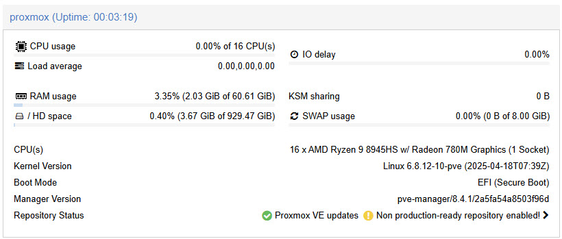
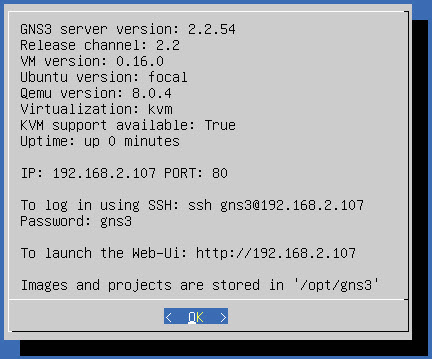

# GNS3 Install

GNS3 can be installed on [Windows](https://docs.gns3.com/docs/getting-started/installation/windows), [macOS](https://docs.gns3.com/docs/getting-started/installation/mac), or [Linux](https://docs.gns3.com/docs/getting-started/installation/linux) either as a standalone application or in conjunction with the [GNS3 VM](https://docs.gns3.com/docs/getting-started/installation/download-gns3-vm) for enhanced performance and emulator support. GNS3 VM acts as a compute backend running emulators like QEMU, Dynamips, or Docker. For best results, especially when working with resource-intensive images, it's recommended to install the GNS3 VM. GNS3 VM is available for popular virtualization platforms such as:

- VMware Workstation/Player
- Oracle VirtualBox
- Microsoft Hyper-V
- KVM/QEMU

## GNS3 VM and Type-1 Hypervisors

GNS3 can be effectively deployed on type 1 hypervisors such as `VMware ESXi` and `Proxmox VE`, providing a scalable foundation for network simulation. In this architecture, the GNS3 VM runs on the hypervisor, while the GNS3 user interface is typically executed on a separate management workstation. This separation of compute and control layers enables efficient offloading of resource-intensive tasks, supports larger and more complex network topologies, and improves overall performance. With proper configuration including nested virtualization, bridged networking, and optimized CPU settings GNS3 on type 1 hypervisors offers near-native performance, enhanced reliability, and is well-suited for enterprise-grade labs, multi-user environments, and advanced simulation workflows.

## Proxmox Virtual Environment (VE)

Proxmox VE is an open-source, Debian-based type 1 hypervisor that provides virtualization through KVM and LXC, offering an integrated web-based management interface, high availability clustering, backup/restore tools, and support for both virtual machines and containers. Unlike VMware ESXi, which is a proprietary hypervisor focused solely on VM-based virtualization and typically requires a commercial license for advanced features, Proxmox VE is fully open-source and provides robust enterprise features such as live migration, ZFS storage integration, and full API access without licensing restrictions. While ESXi is widely used in enterprise datacenters for its stability and ecosystem, Proxmox is favored in home labs, startups, and open-source environments for its flexibility, transparency, and low cost of ownership.

In my home lab, I run Proxmox VE on the MINISFORUM UM890 Pro, a compact yet powerful mini PC. This system features 64 GB of DDR5 RAM and a high-speed 1 TB PCIe 4.0 NVMe SSD, delivering high performance for virtualization workloads. At its core is the AMD Ryzen 9 8945HS processor, an 8-core, 16-thread CPU built on Zen 4 architecture, integrated with Radeon 780M graphics, making it well-suited for demanding compute and graphics tasks in a space-efficient form factor.



Follow these [video instructions](https://youtu.be/qmSizZUbCOA) to setup your Proxmox.

## Setting up GNS3 VM on Proxmox VE

Follow these [video instructions](https://youtu.be/UfqjqigS-OM) or refer to the detailed steps below to deploy the GNS3 VM on Proxmox VE.

Open your browser and navigate to the Proxmox VE web UI:

    https://192.168.2.136:8006

Open the Proxmox shell (via web UI or SSH) and check if nested virtualization is enabled:

For AMD-based systems:

```bash
cat /sys/module/kvm_amd/parameters/nested
```

For Intel-based systems:

```bash
cat /sys/module/kvm_intel/parameters/nested
```

If the result is `1`, nested virtualization is enabled. If not, you'll need to enable it and reboot the host.

Visit the [GNS3 release page](https://github.com/GNS3/gns3-gui/releases/tag/v2.2.54).

Download `GNS3.VM.VMware.ESXI.<version>.zip` file.

Extract the zip archive to obtain the OVA file.

In the Proxmox Web UI, navigate to:

    Datacenter → Node → local (or your target storage) → Import → Upload

Upload the OVA file.

Go back to the Proxmox shell and navigate to the upload directory:

```bash
cd /var/lib/vz/import
```

Extract the OVA file:

```bash
tar xvf GNS3_VM.ova
```

Import the VM using a unique VM ID:

```bash
qm importovf 102 "GNS3 VM.ovf" local
```

Replace `102` with your preferred available VM ID, and `local` with your Proxmox storage name. You can list valid storage options using:

```bash
pvesm status
```

Locate the new VM (named something like `Clone-of-gns3`) in the Proxmox Web UI.

Go to the Hardware tab:

- Add a Network Device. Select your bridge (e.g., vmbr0) connected to your LAN
- Increase Memory (e.g., 4–8 GB)
- Assign at least 2 vCPUs and set CPU type to `host`

Open the Console tab, click Start and wait for the VM to boot.

It should display the GNS3 splash screen along with its IP address and API port.



You can now access the GNS3 VM using Web UI by going to:

    http://ip.address.shown.above

Alternatively, you can connect GNS3 GUI to GNS3 VM (I prefer this approach).

Install GNS3 on your Windows, macOS, or Linux system.

When prompted, choose: "Run appliances on a remote server".

Enter the IP address and port of the GNS3 VM.

If you have an existing GNS3 installation, then open GNS3 and go to:

    Edit | Preferences | Server | Remote servers

Click on Add and enter the IP address and port of the GNS3 VM.

Once added, the GNS3 GUI will connect to the Proxmox-hosted GNS3 VM, offloading processing and allowing full use of the GNS3 environment.
