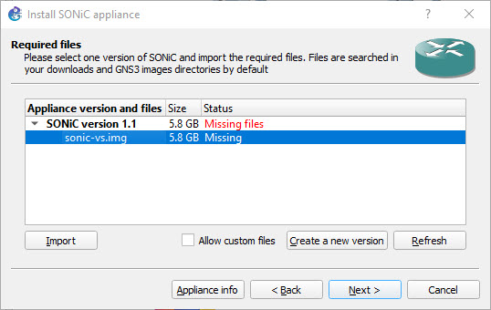
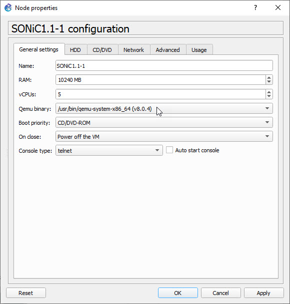

## Creating a SONiC GNS3 Appliance

Download the latest `sonic-vs.img` QCOW2 image from the SONiC Image Azure Pipeline. Refer to [here](https://github.com/ManiAm/sonic-proxy/blob/master/README_Sonic.md#downloading-sonic-qcow2-image) for more details. After extracting the image, create a GNS3 appliance using the `sonic-gns3a.sh` utility:

```bash
sonic-gns3a.sh -r 1.1 -b /path/to/sonic-vs.img
```

This will generate a GNS3 appliance definition file named `SONiC-1.1.gns3a`.

## Installing the Appliance in GNS3

To import the appliance, open the GNS3 GUI and navigate to:

    File → Import Appliance

When prompted to choose the server type, select "Install the appliance on a remote server" if your GNS3 VM is running remotely for example, on Proxmox VE. GNS3 will display the available appliance version and the list of required image files.



Click on a missing image, then choose "Import" to upload the `sonic-vs.img`. GNS3 automatically verifies the image using its checksum and uploads it to the remote GNS3 VM. Once the import is complete, you can drag the "Sonic 1.1" icon onto your workspace. Right-click on the node, select "Configure", and under the General settings tab, set RAM to 10240 MB (10 GB) and vCPUs to 5. Start the node and wait for the Sonic OS to come up. The default credential for login is `admin`/`YourPaSsWoRd`.


