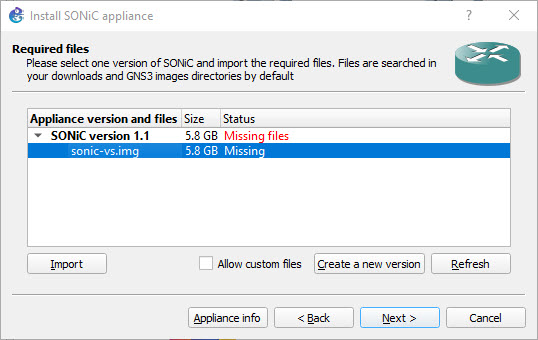
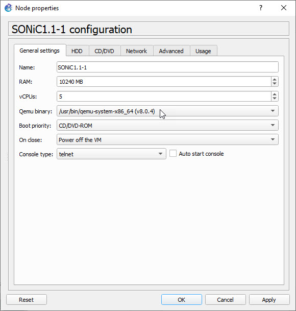

## Obtain the SONiC VS Image

You must obtain the `sonic-vs.img` QCOW2 image. You can either download a prebuilt image from the SONiC build pipeline or [build it locally](./Sonic_Build.md) from source. The easiest approach is to download the latest `sonic-vs.img` from the SONiC Azure Pipeline.

The [SONiC Azure Pipelines](https://sonic-build.azurewebsites.net/ui/sonic/Pipelines) portal hosts official CI/CD pipelines. Each pipeline is associated with a specific hardware platform (e.g., Broadcom, Mellanox, Marvell, Centec, Innovium, Virtual Switch). The portal allows you to monitor builds, access artifacts, and download images suitable for deployment and testing.

Navigate to the VS (Virtual Switch) pipeline on the Sonic CI portal.

Find the master branch and click on the 'Build History'.

Select the latest successful build by clicking on 'Artifacts'.

Under artifacts, click on `sonic-buildimage.vs`.

Download the artifact `target/sonic-vs.img.gz`.

## Creating a SONiC GNS3 Appliance

Extract `sonic-vs.img.gz`:

```bash
gunzip sonic-vs.img.gz
```

Create a GNS3 appliance using the `sonic-gns3a.sh` utility:

```bash
sonic-gns3a.sh -r 1.1 -b /path/to/sonic-vs.img
```

This will generate a GNS3 appliance definition file named `SONiC-1.1.gns3a`.

## Installing the Appliance in GNS3

To import the appliance, open the GNS3 GUI and navigate to:

    File → Import Appliance

When prompted to choose the server type, select "Install the appliance on a remote server" if your GNS3 VM is running remotely for example, on Proxmox VE. GNS3 will display the available appliance version and the list of required image files.



Click on a missing image, then choose "Import" to upload the `sonic-vs.img`. GNS3 automatically verifies the image using its checksum and uploads it to the remote GNS3 VM. Once the import is complete, you can drag the "Sonic 1.1" icon onto your workspace. Right-click on the node, select "Configure", and under the General settings tab, set RAM to 10240 MB (10 GB) and vCPUs to 5. Start the node and wait for the Sonic OS to come up. The default credential for login is `admin`/`YourPaSsWoRd`.


