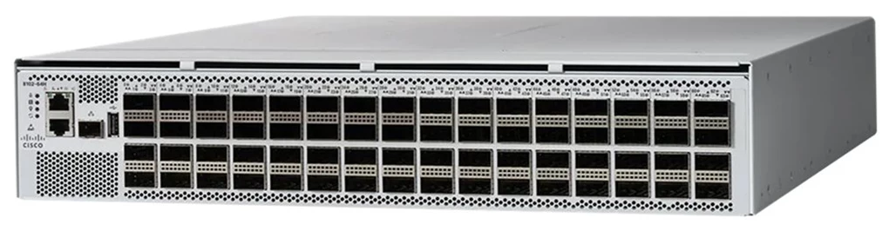
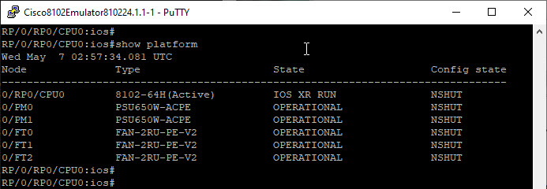

## Cisco 8102

The Cisco 8102-64H, also referred to simply as the Cisco 8102, is a high-performance, fixed form-factor router within the Cisco 8000 Series, specifically designed to meet the rigorous demands of modern data center and AI/ML networking environments. Occupying a 2RU chassis, this router delivers 6.4 Tbps of throughput through its 64 QSFP28 ports, each supporting 100G Ethernet connectivity. This high-density configuration makes it an ideal solution for hyper-scale data centers and large-scale network infrastructures.



Internally referred to as "Matilda64", the 8102 is powered by Cisco's [Silicon One](https://youtu.be/TwrX_XYGXYQ) architecture, utilizing the Gibraltar (G100) Network Processing Unit (NPU). This design choice ensures exceptional energy efficiency and performance without relying on High-Bandwidth Memory (HBM), thereby optimizing power consumption and thermal management. The router supports both Cisco IOS XR and the open-source SONiC network operating systems, providing flexibility and adaptability to various network environments.

Cisco has officially released a virtual router emulator for its 8000 Series platform, including support for the 8102 model, compatible with GNS3 and other network emulation environments. This emulator runs IOS XR version 24.1.1 and leverages the Cisco Silicon One dataplane architecture. To access the emulator, visit the [Cisco Software Download page](https://software.cisco.com/download/beta/1028490534) and download the file titled "8102 platform running IOS-XR 24.1.1 GNS3 integration". This package is provided as a RAR archive and includes the following contents:

```text
OVMF-8102.fd --> bios_image
8102-24.1.1.qcow2 --> HDA disk image
cisco-8102-24.1.1.gns3a --> GNS3 appliance template
```

To import the appliance, open the GNS3 GUI and navigate to:

    File → Import Appliance

When prompted to choose the server type, select "Install the appliance on a remote server" if your GNS3 VM is running remotely for example, on Proxmox VE. GNS3 will try to look for images locally and should be able to locate both 'OVMF-8102.fd' and '8102-24.1.1.qcow2' files. Click 'Next' to proceed with the installation. Be patient as GNS3 uploads the large QCOW2 image to the remote server, which may take some time depending on your network speed. Once the import is complete, you can drag the "Cisco 8102 Emulator" icon onto your workspace.

The memory requirement for the Cisco 8102 Emulator is relatively high, primarily due to its hardware-accurate dataplane implementation that closely emulates Cisco Silicon One architecture. Right-click on the node, select "Configure", and under the General settings tab, adjust RAM value (it is set to 12 GB by default) and set vCPUs to 5. Start the node and wait for the XR OS to come up.


